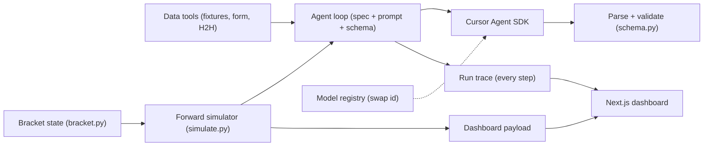

# The Oracle — a World Cup 2026 bracket-prediction agent

An AI agent that **simulates the entire FIFA World Cup 2026 knockout bracket forward** — from
where the tournament stands today to who lifts the trophy — built to teach the full agent
lifecycle on camera: problem → spec → spec-driven build → simulation → results.

One modular agent powers two videos:

- **Video 1 — The Oracle:** the agent explains the signals it uses, then plays the live bracket
  round by round (Round of 32 → Final) to a single predicted champion.
- **Video 2 — Model Battle:** the same bracket run by Claude, ChatGPT, Gemini, Grok and
  Composer — who do they crown, and where do they disagree?

Everything is **explainable**: every module says what it does and why, and every prediction
emits a step-by-step **run trace** you can literally watch.

## Quickstart (offline — no keys, no network)

```bash
cd backend
uv venv --python 3.12 .venv && source .venv/bin/activate
uv pip install -e ".[dev]"

oracle simulate --mock --explain     # one agent plays the whole bracket (Video 1)
oracle simulate-battle --mock        # all 5 models, champions + consensus (Video 2)
oracle predict 1001 --mock --explain # a single-match prediction + run trace (primitive)
oracle export --mock                 # build the dashboard payload
```

Then the dashboard:

```bash
cd ../frontend
npm install
npm run dev          # http://localhost:3000
```

## Going live (real 2026 World Cup data)

Live data comes from **ESPN's public API** (`DATA_SOURCE=espn`, the default) — it has the
current 2026 tournament, needs **no key**, and includes each team's recent form. The only key
you need is `CURSOR_API_KEY` (Cursor Dashboard → API Keys) for the models.

```bash
oracle models                                  # list available model ids
oracle fixtures --status NS                    # live upcoming 2026 matches
oracle simulate                                # the default agent plays the bracket
oracle simulate-battle --models claude,gpt,gemini,grok,composer
oracle export                                  # regenerate the dashboard each matchday
```

Live model calls are the slow part: one full bracket is up to 31 predictions, so
`oracle export` runs roughly `31 x models`. Mock runs are instant.

### Data sources

- `DATA_SOURCE=espn` (default) — free, live FIFA World Cup 2026, no key. See
  [`backend/oracle/tools/espn.py`](backend/oracle/tools/espn.py).
- `DATA_SOURCE=api_football` — API-Football (api-sports.io). Note: the **free tier only covers
  seasons 2022–2024**, so it can't serve 2026 without a paid plan. Set `WC_SEASON=2022` to demo
  on the last World Cup with real results.
- `USE_MOCK_DATA=1` (or `--mock`) — bundled offline data, no network or keys.

## Architecture



## Lifecycle → where it lives

| Step | Artifact |
| --- | --- |
| Problem / use case | [`spec/AGENT_SPEC.md`](spec/AGENT_SPEC.md) §1, [`docs/01-problem.md`](docs/01-problem.md) |
| Spec | [`spec/AGENT_SPEC.md`](spec/AGENT_SPEC.md), [`spec/EVAL_SPEC.md`](spec/EVAL_SPEC.md) |
| Spec-driven dev | [`backend/oracle/schema.py`](backend/oracle/schema.py) |
| Build | [`backend/oracle/agent.py`](backend/oracle/agent.py), [`backend/oracle/models.py`](backend/oracle/models.py) |
| Tools / data | [`backend/oracle/tools/`](backend/oracle/tools) |
| Bracket + simulation | [`backend/oracle/bracket.py`](backend/oracle/bracket.py), [`backend/oracle/simulate.py`](backend/oracle/simulate.py) |
| Evals | [`backend/oracle/eval/`](backend/oracle/eval) |
| Results | [`frontend/`](frontend), [`backend/oracle/dashboard.py`](backend/oracle/dashboard.py) |
| Explainability | [`backend/oracle/trace.py`](backend/oracle/trace.py) |

## Documentation = video scripts

Each file in [`docs/`](docs) is one lifecycle step written as a recordable segment, with the
exact commands to run on camera and the talking points to say. The two
[`docs/scripts/`](docs/scripts) files —
[`video-1-oracle.md`](docs/scripts/video-1-oracle.md) and
[`video-2-battle.md`](docs/scripts/video-2-battle.md) — are full shooting scripts for the two
headline videos, reusing the step explainers so you never re-explain the build from scratch.

Start at [`docs/00-overview.md`](docs/00-overview.md).

## How the explainability works

- **In-code:** every module opens with What / Why / How it fits / an "On camera" line.
- **Run trace:** [`backend/oracle/trace.py`](backend/oracle/trace.py) records each step
  (gather_data → build_prompt → call_model → parse_validate → apply_persona → store). Use
  `--explain` in the CLI; the dashboard replays it as a timeline.

## A note on the models

This uses the Cursor **Agent SDK** (`cursor-sdk`), not a raw model API. Cursor doesn't expose
its built-in models as a generic LLM endpoint; the Agent SDK is the supported way to run them
programmatically with one `CURSOR_API_KEY`. The model id is the only thing that changes between
battle contestants. `oracle/models.py` is a thin adapter, so you can later swap in OpenRouter or
provider keys without touching the agent.
